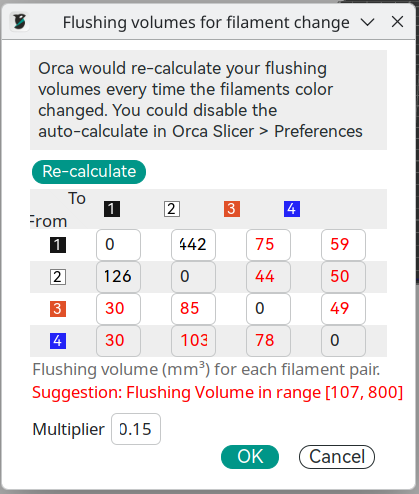
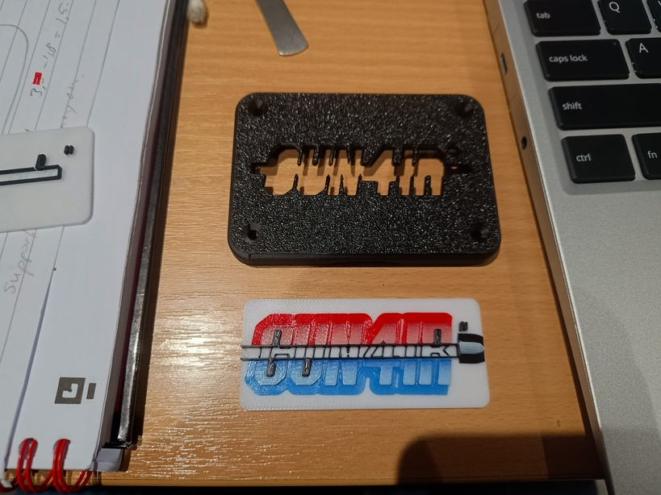
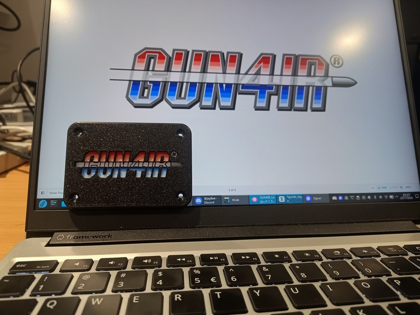

# GUN4IR Logo
3D printing is amazing — you can print custom cases with ease. I have a Bambu P1S with AMS. I don't do many multi‑colour prints because the purging (printer "poop") is very wasteful. I like to challenge myself by limiting to a maximum of one colour swap per print. I try to skip or reduce purging and experiment with mixing two colours so the blend becomes a feature.

The GUN4IR logo uses four colours: red, blue, white, and black. The logo features colour gradients in discrete steps, which reminded me of the stair-step effect when printing a slope (z-height relative to layer thickness). The idea is to use the more translucent colour to build up the slope and create the colour change.

I count five bands for the colour gradient. Using a layer height of 0.2 mm, the slope height is (5 + 1) * 0.2 = 1.2 mm — the extra +1 is a margin to allow for slicer behaviour.

# Printing instructions

Global settings

- Layer height: 0.2 mm
- Detect thin walls
- Disable prime tower

The GUN4IR logo consists of five parts.

| Part           | Colour 1 | Colour 2 | Swap layer | Flushing volume multiplier | Brim |
| -------------- | -------- | -------- | ---------- | -------------------------- | ---- |
| cover          | black    |          |            |                            |      |
| base           | white    | black    | 7          | 0.70                       |      |
| bullet         | black    | white    | 6          | 0.70                       | 3 mm |
| letters lower  | blue     | white    | 5          | 0.15                       | 3 mm |
| letters upper  | red      | white    | 5          | 0.15                       | 3 mm |

For the red→white and blue→white transitions, you can get away with a reduced flushing volume. For black↔white you do need to purge the extruder properly. I set the global multiplier to 0.15 but restored the black↔white parameters to their default values. In theory you could use these flushing volume settings:

# Assembly instructions

The bullet and letters are printed with a brim. This helps keep the letter parts together and also aids alignment with the base. Some trimming of the brim is needed to make the letters fit.

The base can then be pressed into the top cover.

You can use superglue to bond the parts.

The design is made without clearance; the parts are small and thin enough that they will flex into place. Your mileage may vary depending on your printer.

[← Back to GUN4IR Mods](README.md)