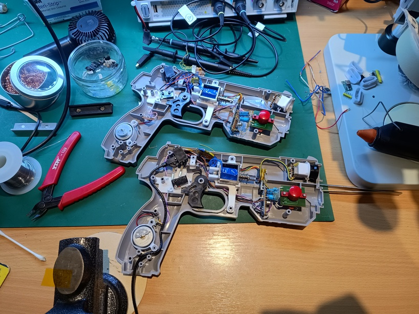
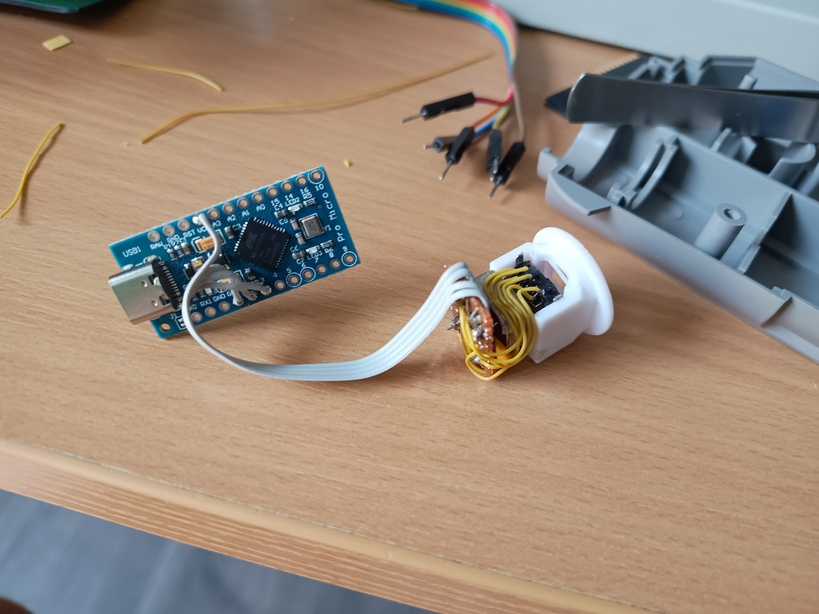
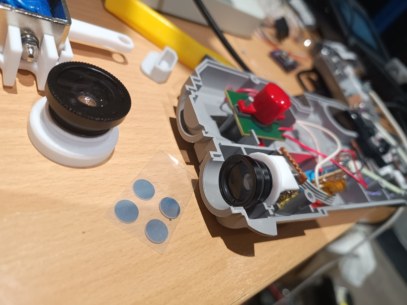
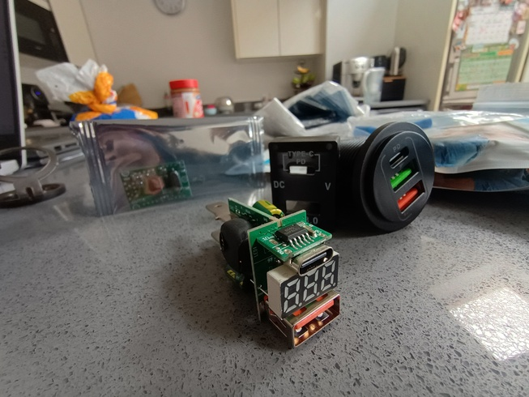
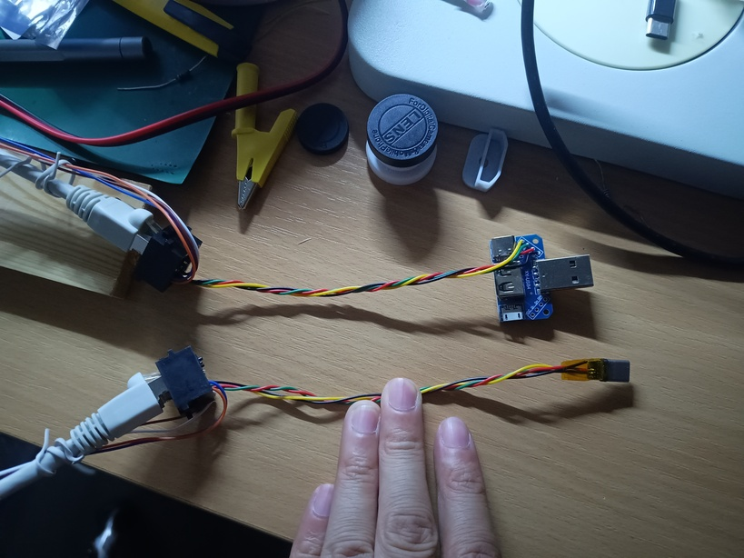
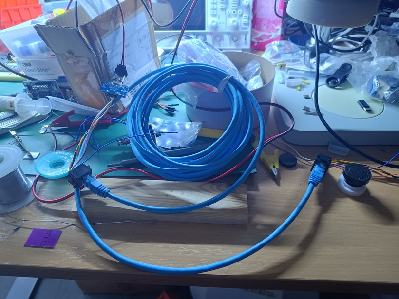
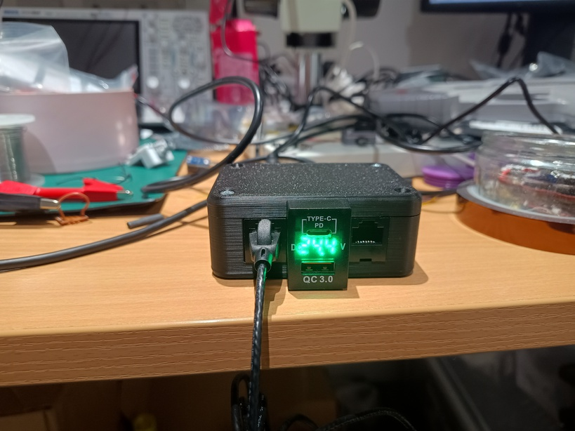
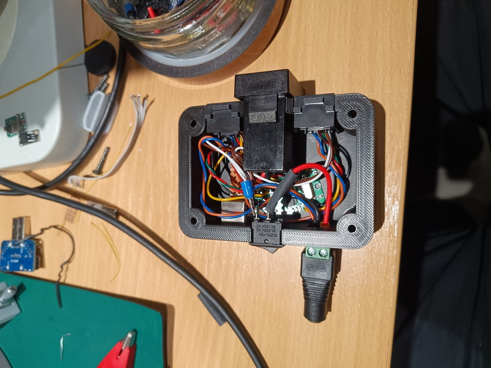

# My GUN4IR blog and mods
## Table of Contents

- [Trigger switch and Recoil](#trigger-switch-and-recoil)
- [Wiimote Sensor and Lens](#wiimote-sensor-and-lens)
- [USB Hub and Power](#usb-hub-and-power)
    - [USB over CAT](#usb-over-cat)
    - [Custom hub](#custom-hub)
    - [GUN4IR logo](#gun4ir-logo)
    - [Future ideas](#future-ideas)
- [Bill of materials](#bill-of-materials)
- [Credits and references](#credits-and-references)

I've modified two GunCon1 controllers for my GUN4IR build.

# Trigger switch and Recoil

TODO

# Wiimote Sensor and Lens

TODO

# USB Hub and Power

I didn't like the idea of having two wires coming out of the GunCon1 — one for USB and one for power. I wondered if I could use an Ethernet cable for the controller wire so I could swap cables in the future. Ethernet cable has 8 wires: 4 for USB and 4 for power, which should be sufficient.

With the 24V external power supply I can power other devices. There are USB power modules that support Quick Charge and USB Power Delivery (USB‑PD). This could be used to power a device such as the MiSTer FPGA.

## USB over CAT

I've read that USB cables are recommended up to 1.2 meters. I had a bad experience extending USB cables for a keyboard and mouse setup, which made me cautious.
I needed to check whether USB would work over Ethernet cable. I made a small prototype and, to my surprise, it did work — even with a 5 m cable!

## Custom hub

I want to keep the overall wiring tidy and neat. My plan was to create a custom box to house the USB hub and bring 24V power in to feed the GunCons. On AliExpress I found a PCB-only 4-port USB hub and a 24V power brick, and a 24V-to-USB‑PD power module that could also power my MiSTer FPGA box.

Using Onshape, I've created a simple box with cutouts:

- 2x RJ45 ports
- USB‑PD power out
- USB‑B towards the host
- 24V barrel jack power in
- Power switch

To my surprise, I got all dimensions right, I didn't need to reprint. Some of the connects (DC and USB-B) have a very tight fit.
Wiring is straightforward. I did, however, burn out a USB hub due to incorrect USB wiring. This was caused by a Google search that returned an image with the wrong USB‑B pinout.

## GUN4IR logo

The hub looked boring and needed some flare. I thought the GUN4IR logo would look awesome and asked JayBee for his blessing. He provided me a STEP file, which helped the CAD work.

[click for printing instructions](INSTRUCTIONS_LOGO.md)

## Future ideas

There are a few ideas I have for this hub that would be cool. The USB hub is a 4 port hub. So with 2 GunCon ports, I have two unused ports:

- expose unused USB ports
- built-in USB storage
- a gamepad as the case top — this could make a really cute controller!

# Bill of materials

# Credits and references

## Onshape

[My GUN4IR Onshape project](https://cad.onshape.com/documents/60f3889d38b5e0568d106ee2/w/f5cb8cd99e0bbe5bb5cbe4ad/e/dea12f17ca6bb715148ab42e?renderMode=0&uiState=694b13c5b34aab6deb810d39https:/)
